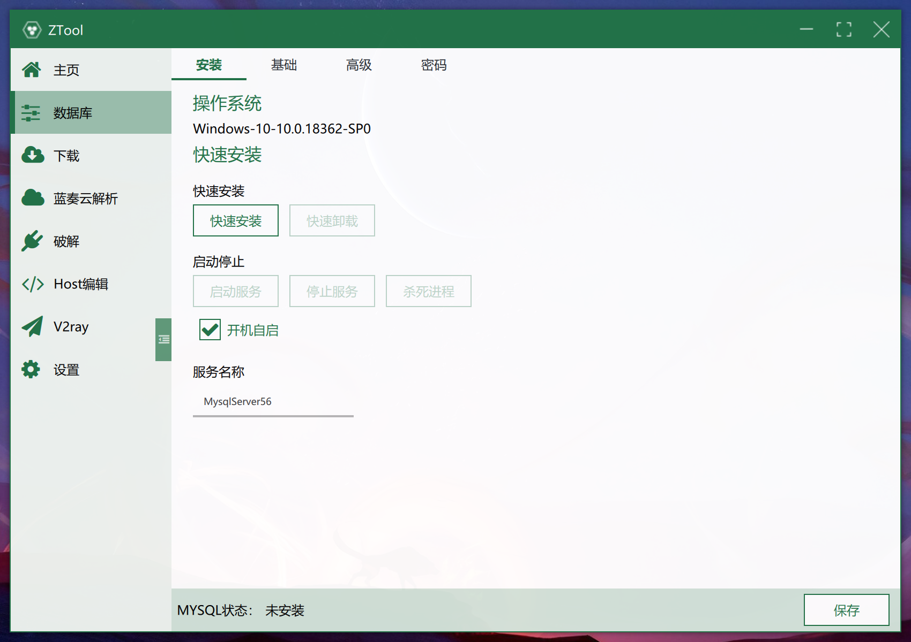
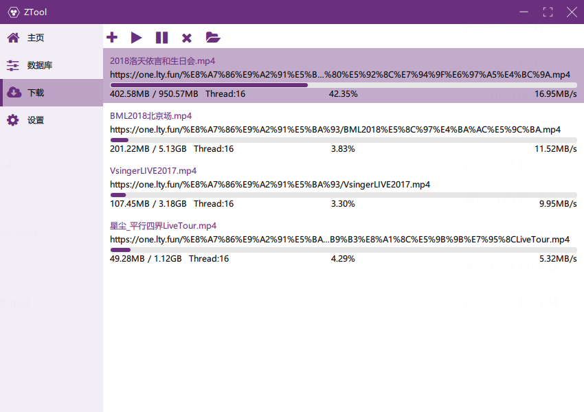
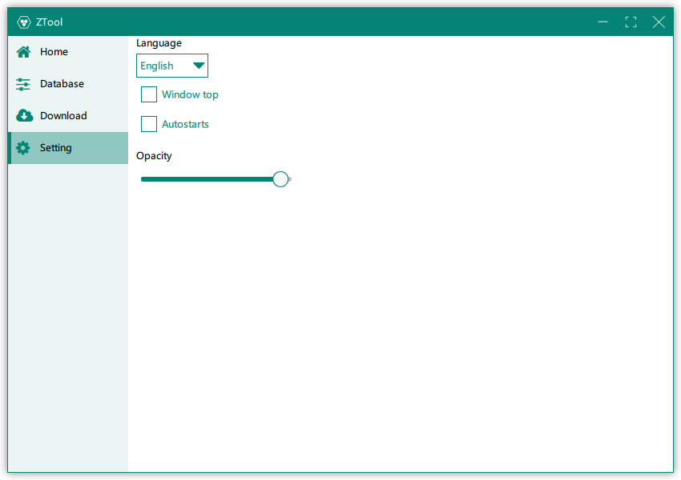
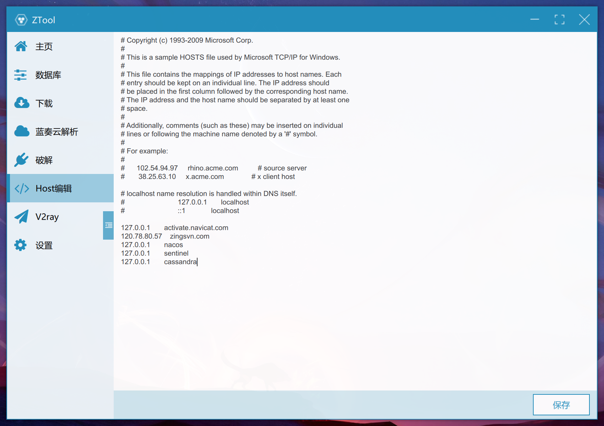
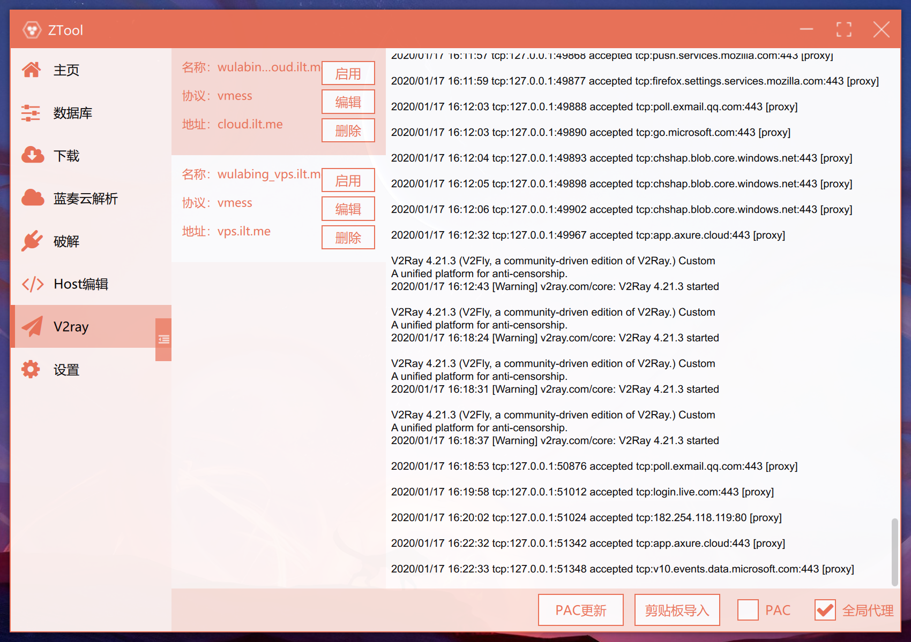

# ZTool (原MysqlTool)
PyQt5 + Qt Quick Controller2
--------
快速安装Mysql 5.6数据库，只需解压运行点击安装即可。绿色运行，方便迁移
## 功能
- Mysql快速启动 / 密码修改，无需原始密码 / 快捷可视化配置
- Aria2 下载
- 多语言热切换
## 技术栈
- IDE：PyCharm + Qt creator
- 前端：PyQt5.10.1 Qml 自定义UI组件
- 后端：Python 3.7.2
- 数据库：Mysql 5.6
- 配置：yaml
- 日志：logging
## 安装
### 步骤
#### 安装依赖包
```
pip install -r .\requirements.txt
```
#### 打包
````
pyinstaller .\package.spec
````
#### 启动运行
````
# shell 环境
pyrcc5 .\ui\qml.qrc -o .\ui\qml_rc.py | python d:/PythonWorkspace/mysql-tool/main.py
````

#### 可执行程序下载
https://github.com/lzx8589561/ZTool/releases/download/F0.0.1/MysqlTool.7z

## 预览
### 2.0版本预览











### 1.0版本预览 源码到release下载

#### 配置
##### mysql
- 默认端口 3309
- 默认root密码 123456
